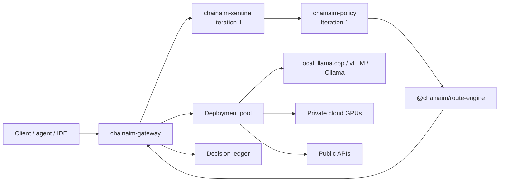
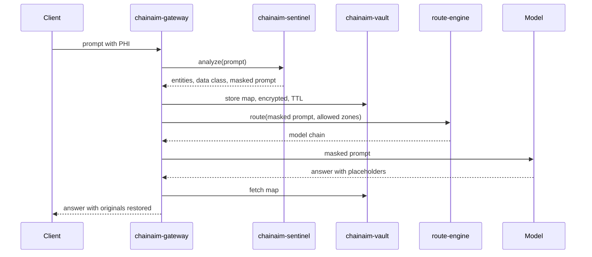
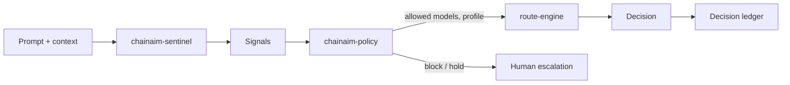

# ChainAim Model Gateway — Design, Privacy Flow & Iteration Plan

As of 2026-09-21 · owner: Sathya Krishnasamy

ChainAim runs its own OpenAI-compatible gateway, which decides per request which model answers and sends it wherever that model is deployed. Iteration 0 is built, tested and running on two free local models. From BlockRun, only the model-selection engine is reused, forked and renamed `@chainaim/route-engine`; no BlockRun gateway, wallet, payment or ClawRouter code is used.

## Architecture and names

The gateway is the only thing clients talk to. It asks the route engine for an ordered model chain, then orchestrates the call to the model's deployments. It retries the next replica or model on failure and records every decision.



| Name | What it is | Status |
| --- | --- | --- |
| `chainaim-gateway` | OpenAI-compatible HTTP API: decide, dispatch, fallback, health, ledger | **Running** (Iteration 0) |
| `@chainaim/route-engine` | Model selection, fork of BlockRunAI/router-core (MIT, notice kept) with two ChainAim changes | **Running** |
| Model catalog | `config/catalog.json`: models, zone, capabilities, pricing, deployments, chains per profile | **Running** |
| Deployment pool | Health probes, least-busy replica, cooldown after failures | **Running** |
| Decision ledger | One line per request; never prompt or answer text | **Running** |
| `chainaim-sentinel` | Context and prompt analyzer (PII/PHI/PCI, risk signals) | Iteration 1 |
| `chainaim-vault` | Placeholder ↔ original map, encrypted, short TTL | Iteration 1 |
| `chainaim-policy` | Signals → allowed zones and models, escalation | Iteration 1+ |

**Routing names clients use:** `chainaim/auto`, `chainaim/eco` and `chainaim/premium` let the gateway choose. A catalog ID such as `local/qwen2.5-1.5b` pins that model.

**Where orchestration runs:** the gateway is one Node process with no npm runtime dependencies, so it runs on a laptop, a VM or a container. Deployments can be anywhere the gateway can reach over HTTP. Iteration 0 ran the gateway and both models in a cloud workspace.

**Why ClawRouter was dropped:** its proxy forwards every prompt to blockrun.ai and is tied to BlockRun's payment rails (its `SKILL.md` and `proxy.ts`). Only router-core is local and product-neutral. The decision is recorded in `docs/adr/0001`.

**What the fork changed** (each marked "ChainAim fork" in the code):

1. `restrictToCatalog`: candidates must be in our catalog. Upstream otherwise adds its own BlockRun model IDs for some task types.
2. `agentRisk` is now returned on decisions, for the escalation rules to use later.

All 107 engine tests pass (104 upstream + 3 new). Upstream's 88-request decision snapshot is unchanged except for the added `agentRisk` field.

## Project structure

The repository `chainaim-router` exists and is committed. Lines marked (planned) are later iterations. Lines marked [SENSITIVE] are ignored by git.

```
chainaim-router/
├── PROJECT_CONTEXT.md              # ground truth for this project
├── README.md                       # endpoints, headers, model names, Windows quick start
├── package.json                    # scripts only; zero runtime dependencies
├── .env.example                    # variable NAMES only
├── .gitignore                      # .env, secrets/, data/, models, *.gguf
├── config/
│   ├── catalog.json                # llama.cpp deployments
│   └── catalog.ollama.json         # Ollama deployments (Windows-friendly)
├── packages/
│   ├── route-engine/               # @chainaim/route-engine (fork; LICENSE + NOTICE kept)
│   └── policy/                     # (planned) signals -> allowed zones/models, escalation
├── services/
│   ├── gateway/
│   │   ├── src/  main.ts · server.ts · engine.ts · pool.ts · dispatch.ts · catalog.ts · ledger.ts
│   │   └── test/ gateway.test.ts   # 18 tests over real sockets
│   ├── sentinel/                   # (planned) context and prompt analyzer
│   └── vault/                      # (planned) encrypted placeholder map
├── scripts/
│   ├── serve-local-models.sh       # llama.cpp launcher (Linux/macOS)
│   ├── serve-local-models.ps1      # llama.cpp launcher (Windows)
│   └── iter0-matrix.ts             # prompt x profile matrix through the gateway
├── eval/
│   ├── prompts/iter0.synthetic.jsonl   # SYNTHETIC data only
│   └── reports/                    # matrix results (jsonl + md)
├── docs/
│   ├── PLAN.md                     # this document
│   └── adr/0001-own-gateway-fork-route-engine-only.md
├── secrets/   [SENSITIVE]          # dev fallback only; prefer OS keychain / secrets manager
├── data/      [SENSITIVE]          # ledger, model logs, (later) vault store
└── models     [SENSITIVE]          # local model weights (large; downloaded, not committed)
```

Runtime dependencies are Node 22 built-ins only (`node:http`, `fetch`, `node:crypto`, `node:util`, `node:test`). Node 22.22 runs the TypeScript directly, so there's no build step. The route engine's build tools (tsup, TypeScript, vitest) are dev-only and are needed only when the fork itself changes.

## Secrets and sensitive data

Secrets stay in the OS keychain or a secrets manager and reach the gateway only as environment variables. The catalog holds the variable *name* (`apiKeyEnv`), and the validator rejects anything that looks like a key value.

| Item | Kind | Where it lives | How it is protected |
| --- | --- | --- | --- |
| Gateway client key | Secret | Env var named by `--api-key-env` | Constant-time comparison; the gateway refuses to listen off-loopback without it |
| Upstream keys (API providers, cloud GPU endpoints) | Secret | Env vars named in the catalog (`apiKeyEnv`) | Least privilege, rotation, a spend cap at the provider |
| Self-hosted model servers | Secret + network | llama.cpp `--api-key` / vLLM `--api-key` | Private network or reverse proxy. vLLM's docs say `--api-key` leaves `/invocations` open |
| Vault key (Iteration 1) | Secret | OS keychain in dev; KMS later | Never on the same disk as vault data |
| Vault entries (Iteration 1) | PHI/PII | `data/vault/` | AES-256-GCM at rest (recommended); short TTL |
| Prompts and answers | Sensitive | Memory only | The gateway never writes them to disk (tested) |
| Decision ledger | Metadata | `data/ledger/`, files `0600`, folder `0700` | Sizes, flags, decision, attempts; never text (tested with a synthetic MRN) |
| Eval reports | Synthetic only | `eval/reports/` | They contain model answers, so real data never goes into `eval/` |

## PHI / PII / PCI: tokenize, route, detokenize

Replace each sensitive value with a numbered placeholder before anything is routed. Keep the originals only in an encrypted local vault, and put them back into the answer before it returns. The router and the model only ever see `<PERSON_1>`, never "John Smith".



What each step does:

| Step | What happens | Basis |
| --- | --- | --- |
| Detect | `chainaim-sentinel` finds entities. Candidate detector: Presidio's analyzer (pattern, checksum, context, NER), e.g. `PERSON`, `US_SSN`, `CREDIT_CARD`, `MEDICAL_LICENSE`, `US_NPI`, `IN_AADHAAR`, `IN_PAN` | Presidio `docs/supported_entities.md` |
| Replace | Each value becomes `<ENTITY_N>`, numbered left to right; the map goes to `chainaim-vault` | Same scheme as LiteLLM's Presidio guardrail (`presidio.py`), read as a reference; LiteLLM is **not** a dependency |
| Route | route-engine sees only masked text, and only models in allowed zones (via `unavailableModels`) | Existing engine input |
| Restore | Placeholders in the answer, including streamed chunks, are swapped back from the vault | Our code (Iteration 1) |

### How Presidio's encrypt and decrypt work (read from its code)

Presidio also has an `encrypt` operator that puts ciphertext into the text in place of a placeholder. From `aes_cipher.py` and `encrypt.py`:

- It uses AES in **CBC mode** with PKCS7 padding and a random 16-byte IV. The output is `base64(IV + ciphertext)`.
- The key must be 128, 192 or 256 bits. A text key is used as its raw UTF-8 bytes, so a 16-character string gives AES-128.
- `decrypt` uses the same key. There is **no authentication tag** in the code, so it hides data but can't detect tampering.

**Recommendation:** use placeholders, not ciphertext, in anything sent to a model. A model can't reason over base64 blobs and may alter them, which would break decryption. Use encryption for data at rest: the vault entries and any stored audit fields, with an authenticated mode such as AES-GCM.

### Handling by data class (my recommendations; your compliance team decides)

| Class | Examples | Default action |
| --- | --- | --- |
| PCI | Card number, CVV | Redact completely; never restore; never send to any model |
| PHI | Name + condition, MRN, member ID, NPI | Placeholder + vault; local models only unless policy allows more |
| PII | Name, email, phone, Aadhaar, PAN | Placeholder + vault; hosted models allowed only on the masked text |
| None found | — | Normal cost/quality routing |

**Gap:** the entity list I read has no diagnosis, condition or drug entity. "Chest pain" in the test prompt would not be detected. PHI detection therefore also needs a context classifier or custom recognizers. Detection accuracy must be measured on the synthetic set before any real data is used.

## chainaim-sentinel: context and prompt analyzer

Sentinel turns each request into signals. `chainaim-policy` turns signals into limits, and the route engine ranks only inside those limits. Privacy and security narrow the choice first; cost and quality pick last.



Each policy output uses a route-engine input that already exists (`types.ts`), or a gateway action:

| Capability | Signal from sentinel | Policy output | Mechanism |
| --- | --- | --- | --- |
| Privacy | Data class (PCI / PHI / PII / none), entity types and counts | Only models in allowed zones (e.g. `local` for PHI) | `unavailableModels` = every model outside the zone |
| Cost | Caller budget left, request size | Cheaper routing | `routingProfile: "eco"` |
| Quality | Stakes flag from caller or policy | Best-quality routing | `routingProfile: "premium"` |
| Capability | Tools, images, JSON schema | Hard eligibility filters | `hasTools`, `requiresTools`, `hasVision`, `requiresStructuredOutput` (already wired in the gateway) |
| Security | Prompt-injection or jailbreak cues, secrets pasted in the prompt | Block, or restrict to a sandboxed model | Gateway rejects before routing |
| Accountability | Decision ID, caller, policy version | Ledger record | Ledger exists now; caller and policy fields come in Iteration 2 |
| Human escalation | Low `confidence`, PHI with no allowed model, high `agentRisk` | Hold and notify a reviewer | `confidence` and `agentRisk` (fork change) are on every decision |

The catalog already stores each model's `zone` (`local`, `private-cloud`, `public-api`), which is what the privacy rule acts on. Presidio has no diagnosis or condition entity, so sentinel will also need a health-context classifier.

## Iteration plan

Iteration 0 is done. Next comes privacy, because public-API models (Claude, OpenAI) must not be connected until masking works. After that: accountability, security, cost, escalation, then smarter classification.

| # | Goal | What gets built | Done when | Who does what |
| --- | --- | --- | --- | --- |
| 0 ✓ | Own gateway on free local models | `chainaim-gateway`, `@chainaim/route-engine` fork, catalog, pool, ledger, llama.cpp launcher, matrix runner | **Met:** 107 engine + 18 gateway tests pass; matrix 30/30; live failover and recovery shown | AI: all. You: nothing yet |
| 1 | Privacy | `chainaim-sentinel` (detector + health-context rules), `chainaim-vault` (AES-256-GCM, TTL), `chainaim-policy` zone rule (PHI/PCI → `local`), placeholder restore including streams | No synthetic identifier leaves the allowed zone; restore is exact; detection recall reported per entity | AI: code + tests. You: decide on the Presidio dependency (question 4) |
| 2 | Public-API models + accountability | Adapters for OpenAI and Anthropic, each checked against the provider's docs; caller identity and policy version in the ledger; ledger report command | A masked request can use a public model only when policy allows; every call traceable by decision ID | AI. You: API keys into the keychain, spend caps at providers |
| 3 | Security | Prompt-injection and secret-in-prompt checks; TLS and reverse proxy in front of model servers; key rotation runbook | Red-team synthetic set handled as policy says | AI: checks + config. You: network and firewall |
| 4 | Cost | Measured $/1M per model (llama.cpp returns tokens/sec in `timings`), per-caller budgets, portfolio strategy calibrated on our models | Cost per request in the ledger; a budget cap stops spend | AI. You: GPU/VM hourly prices |
| 5 | Human escalation | Hold queue + reviewer notice for low confidence, PHI with no allowed model, high `agentRisk` | Held requests visible, approvable, audited | AI. You: pick the channel |
| 6 | Smarter classification + scale | Hybrid classifier (rules, plus a local embedding model when the engine is unsure); vLLM GPU deployments; more replicas | Better tier and PHI accuracy than Iteration 1 on the same eval set | AI. You: label a sample set, provide GPUs |

## Iteration 0 results (run 2026-09-19)

All 30 calls succeeded (10 synthetic prompts × 3 profiles) on two free models served locally by llama.cpp: Qwen2.5 0.5B and 1.5B (Q4_K_M, CPU, 2 threads, 64-token answers). Eco sends medium work to the small model; premium always uses the larger one.

| Prompt | Category | Tier | auto → model (ms) | eco → model (ms) | premium → model (ms) |
| --- | --- | --- | --- | --- | --- |
| simple-1 | simple | SIMPLE | 0.5b (434) | 0.5b (368) | 1.5b (1538) |
| simple-2 | simple | SIMPLE | 0.5b (845) | 0.5b (703) | 1.5b (1629) |
| simple-3 | simple | SIMPLE | 0.5b (610) | 0.5b (491) | 1.5b (1637) |
| reason-1 | reasoning | REASONING | 1.5b (6696) | 1.5b (6325) | 1.5b (6246) |
| reason-2 | reasoning | MEDIUM | 1.5b (7303) | 0.5b (3225) | 1.5b (6374) |
| code-1 | code | MEDIUM | 1.5b (6801) | 0.5b (3041) | 1.5b (6330) |
| code-2 | code | MEDIUM | 1.5b (6712) | 0.5b (2998) | 1.5b (6599) |
| phi-1 | PHI (synthetic) | SIMPLE | 0.5b (3165) | 0.5b (2861) | 1.5b (4794) |
| pii-1 | PII (synthetic) | SIMPLE | 0.5b (3194) | 0.5b (2766) | 1.5b (7082) |
| pci-1 | PCI (synthetic) | MEDIUM | 1.5b (3023) | 0.5b (2201) | 1.5b (2200) |

Median latency was 2,484 ms on the 0.5B model (14 calls) and 6,328 ms on the 1.5B model (16 calls).

**Failover test (live):** with the 1.5B server stopped, a `chainaim/premium` request was served by the 0.5B model on the second attempt. The next health round marked the 1.5B server down. After a restart it was healthy again and served the next request on the first attempt. The ledger recorded both attempts and contained no prompt text.

**What Iteration 0 shows, and what it doesn't:**

- **Routing and orchestration work.** Profiles, tiers, fallback, health and ledger all behaved as designed.
- **Privacy isn't handled yet.** The PHI, PII and PCI prompts went to a model unchanged; they only stayed on that machine because both models are local. The 0.5B model also invented an age for the synthetic patient. Answer quality at this size is low and wasn't scored.
- **Tier classification is still upstream's.** reason-2 (a train word problem) was classed MEDIUM by upstream's keyword rules, even though it asks for step-by-step working (the exact cause is not yet traced). ChainAim-specific tuning belongs to Iteration 6.

## Questions for you

Questions 1–4 decide Iteration 1. Each has the default I'll use if you don't answer.

| # | Question | Why it matters | Default |
| --- | --- | --- | --- |
| 1 | Which GitHub org should `chainaim-router` live in? (Local folder is now `D:\CHAINAIM\mcp-server\x402\chainaim-router-iter0\chainaim-router`.) | The code needs a permanent home and history | A new private repo under your ChainAim org |
| 2 | Which regulations apply: HIPAA, PCI DSS, India's DPDP Act, GDPR? | Sets the entity list and the zone rules | HIPAA + PCI + DPDP |
| 3 | May a public-API model ever see *masked* PHI, or only `local` models? | The central privacy rule | PHI and PCI: `local` only. Masked PII: public API allowed |
| 4 | Is Presidio (Python, plus a spaCy language model) acceptable as sentinel's detector? | It is the one sizeable dependency in the plan | Yes, as a separate Python service behind HTTP |
| 5 | Where will models run beyond a laptop: a GPU VM, Kubernetes? | Decides the Iteration 6 deployment work | Laptop for dev; one GPU VM for vLLM later |
| 6 | What does "Cursor inference on a cloud" mean for you? | Still unanswered | Cursor is a client of `chainaim-gateway` |
| 7 | Who approves escalated requests, and on which channel? | Iteration 5 | One reviewer by email |
| 8 | How long may the vault keep mappings? | Longer TTL means more exposure; shorter can break multi-turn chats | 1 hour, deleted when the session ends |

**Next step:** answer 1–4. Iteration 1 is then built in the same repository.

## Sources

Everything below was read or run while building Iteration 0.

- [BlockRunAI/router-core](https://github.com/BlockRunAI/router-core) at commit `814fd3b6`: forked as `@chainaim/route-engine`
- [BlockRunAI/ClawRouter](https://github.com/BlockRunAI/ClawRouter): `SKILL.md`, `proxy.ts`, `response-store.ts`. Read to decide against reusing it
- [ggml-org/llama.cpp](https://github.com/ggml-org/llama.cpp): `tools/server/README.md` (endpoints, flags). Built from source and run
- [Qwen2.5-0.5B-Instruct-GGUF](https://huggingface.co/Qwen/Qwen2.5-0.5B-Instruct-GGUF) and [Qwen2.5-1.5B-Instruct-GGUF](https://huggingface.co/Qwen/Qwen2.5-1.5B-Instruct-GGUF): the Iteration 0 models
- [microsoft/presidio](https://github.com/microsoft/presidio): `supported_entities.md`, `anonymizer/index.md`, `aes_cipher.py`, `encrypt.py`
- [BerriAI/litellm](https://github.com/BerriAI/litellm): `guardrail_hooks/presidio.py`, read as a reference design only
- [vllm-project/vllm](https://github.com/vllm-project/vllm): OpenAI server, metrics and tool-calling docs
- [Ollama OpenAI compatibility](https://docs.ollama.com/api/openai-compatibility)
