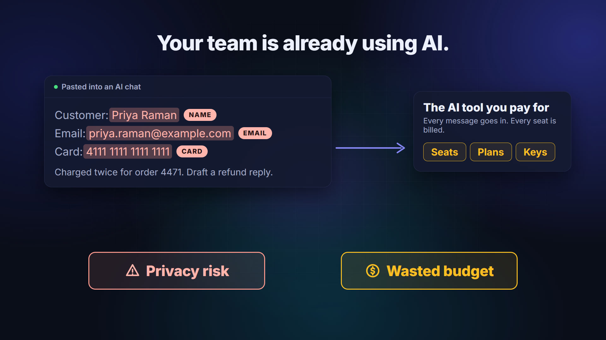
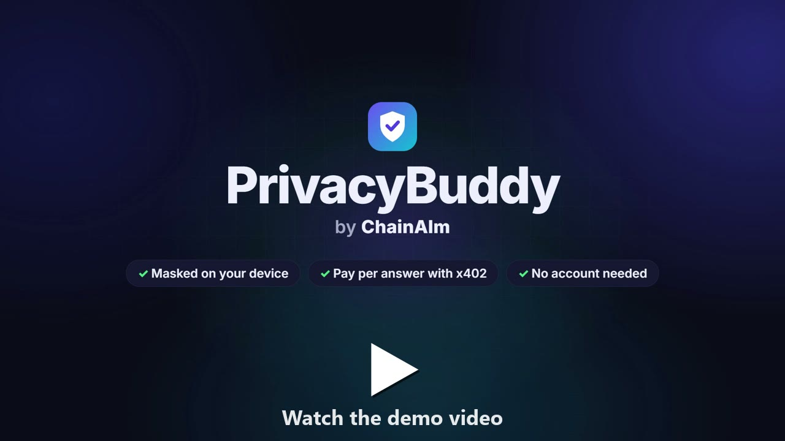
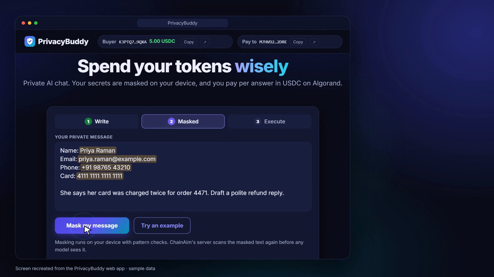
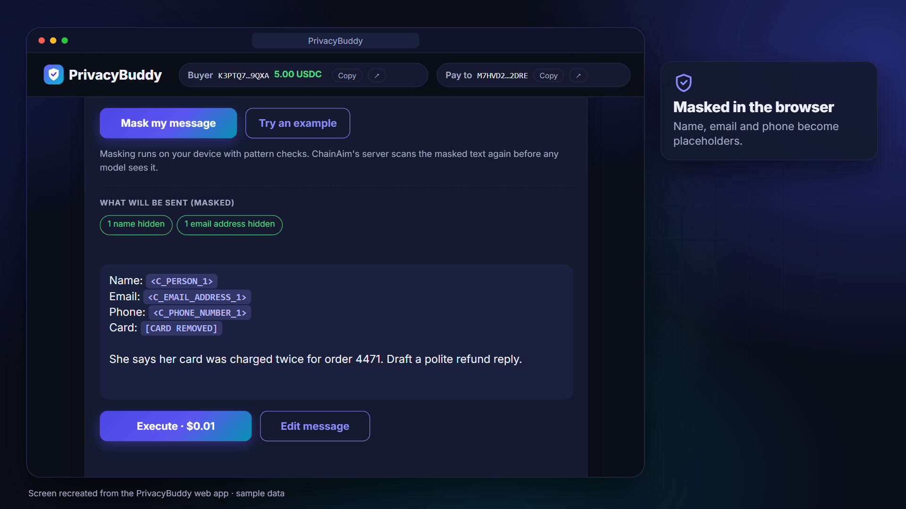
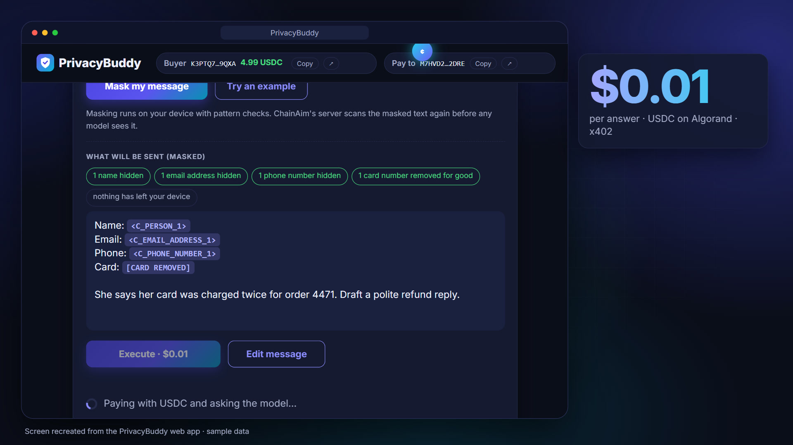
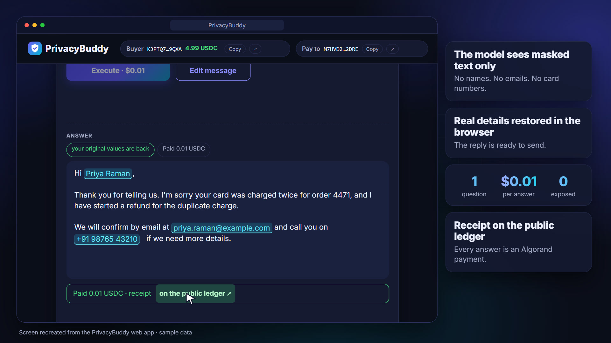
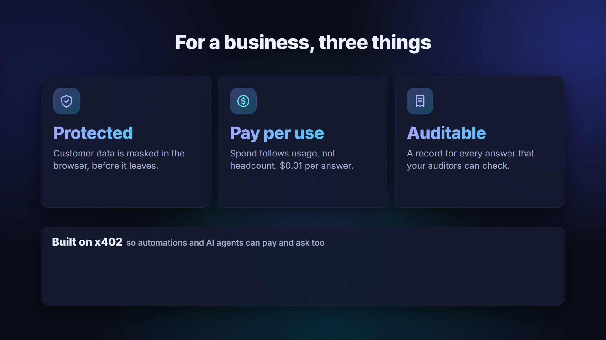

<!--
Editor notes (GitHub does not render this block, and Medium's importer drops it).

How to post on Medium:
  A. Push this folder, open the rendered .md on GitHub, then in Medium choose
     Stories > Import a story and paste the GitHub URL. The images come along
     because GitHub serves them.
  B. Or paste the text into a new Medium story and drag the files in
     docs/blog/images into place where each ![...] line is.
Medium has no tables, so this post uses none. Code blocks and inline code work.

Before posting, check the two bracketed lines near the end against what is live.
-->

# An AI chat that never sees the customer's name, for a cent an answer

*What we built for the Algorand Global x402 Challenge, and the privacy rules we wrote down before we wrote code.*

Your support team already uses AI. Someone pastes a customer's message into a chat window and asks for a refund reply, and the customer's name, email, phone number and card number go to whichever model provider sits behind that window. The company pays for seats, plans and API keys so that this can happen.

We wanted the same workflow with two changes: the model never gets the real values, and nobody has to buy a seat to use it. The result is PrivacyBuddy, a small web page on top of ChainAim's privacy gateway. It masks the message in the browser, charges one cent per answer in USDC on Algorand through x402, and puts the real values back into the reply on the user's own device.



The screens in this post are recreations of the web app from our demo video, with sample data. Priya Raman is a fictional customer and the card number is a standard test number.

[](https://drive.google.com/file/d/1Tquz5qy8m2Yho9Ju04sZX0T39bS4ulJa/view?usp=drive_link)

## Mask first, on your own device

The page has three steps: Write, Masked, Execute. You paste the message and click Mask.



Masking runs in the browser with pattern checks, and no language model is involved at this step. The checks catch card numbers (with a Luhn check), Aadhaar, PAN and IFSC codes, email addresses, Indian mobile numbers, bank account and medical record numbers that sit next to a label, and names that follow a label such as "Name:" at the start of a line, "Patient:", "Dr." or "Mrs.".

Each value becomes a numbered placeholder like `<C_PERSON_1>`. The same value always gets the same placeholder, so the model can still tell that two mentions refer to one person. Card numbers are treated differently: they become `[CARD REMOVED]` and are never put back. A refund reply does not need the card number.



At this point nothing has left the device and nothing has been paid. The chips above the text list what was hidden, and one of them says exactly that: "nothing has left your device".

## Pay a cent, get the answer

Execute costs $0.01, paid in USDC on Algorand. The payment uses x402, the HTTP payment protocol, so there is no account to create and no API key to hand out and later leak. The buyer wallet and the pay-to wallet show in the top bar.



Before the server forwards anything, it runs the same checks again. If the text still holds a value the masker would have caught, the request is refused with the message "Mask it first. Nothing was sent or paid." The server also caps how often one visitor can execute per minute, and how many executes the whole page allows per hour, which bounds what the demo wallet can spend.

The model works on the masked text. When the answer comes back, the browser swaps the placeholders for the original values and shows a small badge: "your original values are back". The map that links placeholders to values never leaves the browser. Every payment is an Algorand transaction, so each answer comes with a receipt on a public ledger.



## What sits behind the page

PrivacyBuddy is a front end for three paid endpoints on the ChainAim privacy gateway, and any x402 client can call them without our page. Each costs $0.01.

- `POST /v1/privacy/scan` finds personal, health and card data in a text and returns the entity types, their positions, the data class and the data policy. No model is called.
- `POST /v1/privacy/mask` returns the masked text, the map to restore it, and counts per type.
- `POST /v1/chat/completions` is an OpenAI-compatible chat. It masks the conversation, classifies it, routes it to a model and restores the answer.

The gateway has two halves. A public paywall handles x402 and proxies to a private gateway on an internal network. The gateway talks to a Presidio analyzer for entity detection and to OpenRouter for the model call.

```
agent ──HTTPS──▶ paywall (public, x402) ──private network──▶ gateway ──▶ OpenRouter free models (chat)
                   │                                           ├──▶ OpenRouter Decisions API (Jev)
                   └──▶ GoPlausible facilitator                └──▶ Presidio analyzer (private)
```

For a chat call, the gateway first sends the text to Presidio, which runs on the same private network, and masks whatever it finds, including anything the browser missed. TypeSafe's Jev model, reached through OpenRouter's Decisions API, then classifies the masked request, and a scoring table picks one of OpenRouter's free models by quality, task, speed and domain. When the answer returns, the gateway restores its own placeholders and the browser restores the rest.

Health data takes a stricter path. It never goes to Jev, and it only goes to model providers that do not collect data. If no such provider is available, the request is refused and the caller is not charged.

## The rules we wrote down first

We put the privacy rules into the design document before the code. The short version:

- Message text and tool-call arguments leave the private network only after Presidio has scanned them. If Presidio is down, scan, mask and chat answer 503 instead of sending anything.
- The decision ledger records data classes and counts. It never holds text, placeholders or the restore map.
- The paywall strips the payment headers before proxying, so the gateway never learns who paid.
- Card numbers are removed, never restored.
- Only allowlisted request fields reach a model, so a client cannot override the data policy.
- A refusal is free. Payment settles only when the gateway answers with a status below 400.

That last rule is the part of x402 we like most. With a subscription, a failed request still costs you the seat. Here a refusal costs nothing, and the paywall only asks for payment on chat when free-model capacity is available to serve it.

## Why x402

Pay per call changes who can use the service. An AI agent with a wallet can read the price, pay a cent and get an answer, with no signup form and nobody handing out keys. The same goes for a script, a browser page like ours, or a person with a wallet.



For a business, that means customer data is masked before it leaves the browser, the bill grows with the number of answers instead of the number of people, and every answer has a record an auditor can check.

## What it does not do

Detection is automated and it can miss things. The browser checks are patterns, so a name with no label in front of it is left to the server's scan, and the server's scan is not perfect either. We are measuring recall on a synthetic set, and we claim no compliance certification. Diagnoses, drug names, ages, dates and places are not masked, either because the model needs them or because they are not detected.

Chat forwards tool definitions, the `response_format` schema, stop sequences, `tool_choice` and tool-call ids as sent, without scanning them. Personal data should not go in those fields.

Chat runs on OpenRouter's free models, which have rate limits, so capacity is limited. Scan and mask do not depend on OpenRouter.

The web page runs against Algorand TestNet, and its buyer key is a hot wallet on a server. That is fine for a TestNet demo and wrong for real money. Before any MainNet use it needs wallet connect.

## Try it

The code is open at https://github.com/chainaimdev/chainaim-router. The README has a local setup that needs no keys and no Docker, with stubs standing in for Presidio and OpenRouter:

```bash
npm run stub-presidio
npm run stub-openrouter
OR_DUMMY=sk-or-dummy node services/gateway/src/main.ts --model-source openrouter-free --openrouter-base-url http://127.0.0.1:5003 --openrouter-key-env OR_DUMMY
node scripts/smoke.ts --chat
```

There is also a command line tool, private-ask, that masks a text file on your computer before paying and sending it. Its dry-run flag shows what would leave your machine and sends and pays nothing.

We built this for the Algorand Global x402 Challenge. [When the MainNet deployment is live, the endpoints are listed in the x402 Bazaar under the tag `x402-global-challenge`. Keep this sentence only once the listing is up.] [Live endpoint: add the paywall URL here once deployed.]
